# Pokémon API
Pokémon API is a web application created as a personal project after completing the Nuclio Digital School Bootcamp of the June 2023 cohort. It gathers data from the PokéAPI and presents it in a fun and dynamic way for all Pokémon enthusiasts.

## Table of Contents

1. Project Description
2. Platform Walkthrough
3. Technologies Used
4. Installation
6. Project Lead
   
# Project Description
Pokémon API is a responsive web application that adapts to various PC screen types. It allows users to view specific data about Pokémon, Berries, Items, and Regions extracted from the PokéAPI (https://pokeapi.co/). The application offers simple and free navigation among its different sections: Pokémons, About, and PokéNews, all presented on a dynamic and uncluttered homepage.

The frontend is built entirely with React and CSS, connecting to a third-party API to display the data. On the backend, a MongoDB database has been created to store blog posts in the PokéNews section.

This project aims to solidify the concepts studied and applied during the completed master's program.
 

# Platform Walkthrough

### Home Page
A fun animation welcomes visitors to this web application. Simple and unpretentious, it avoids overwhelming the user with repeated information. Users can easily find everything they need from a static top navigation bar.

The navigation bar includes the website's icon for quick return to the homepage, as well as links to the Pokémon, About, and PokéNews sections. As an engaging element, a button has been added that allows users to listen to the introductory tune of the Pokémon series, providing a pleasant background while they explore the website. Users have full control to pause or resume playback.

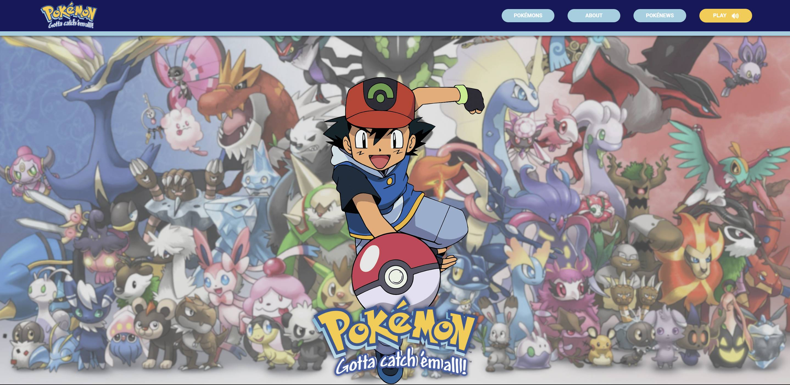

### Pokémons
On this page, users encounter an upper bar that allows navigation between different sections: Pokémons, Berries, Items, and Regions. Each section presents data in a distinct format while maintaining a consistent style and corporate identity.

Pokémons and Regions are presented with a sidebar that displays clickable names to access information in a right-side outlet. On the other hand, Berries and Items are displayed in a card format.

The loading of elements is controlled through an API call that uses a limit and an offset to avoid overloading requests and slowing down page loading. This approach ensures that a limited number of elements are always shown, making their visualization easier.


* Pokémons: Presented with a sidebar that displays different Pokémon from the API, which users can click on to access detailed information in an outlet on the right. A rotating card showcases the main characteristics of the Pokémon, along with its evolution and a description. Evolution links are clickable, allowing users to navigate to the selected Pokémon's profile.
  
  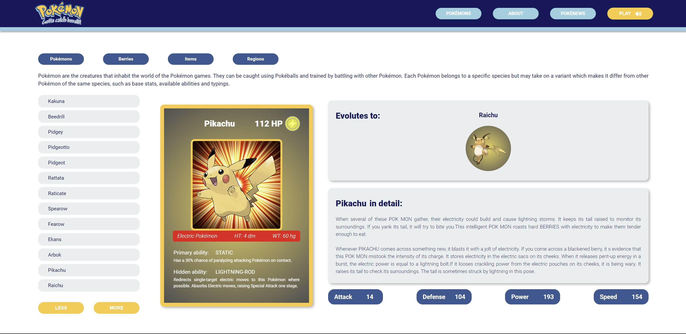

* Berries. Presented in a card format that highlights the most relevant characteristics of these small fruits with significant effects and different flavors.
   
  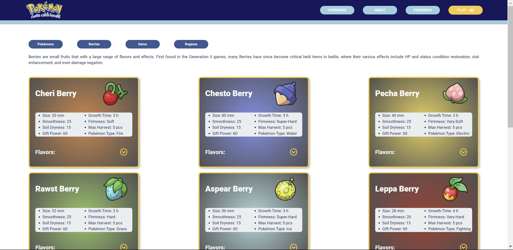

* Items. Presented in a card format that showcases the most relevant characteristics and effects of these items that players can collect and use in battles.
  
  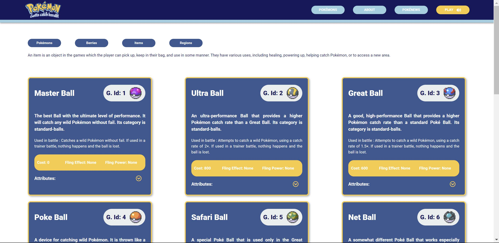

* Regions. Presented with a sidebar that displays different regions in the Pokémon world, allowing users to click and access information in an outlet on the right. An image and a brief description of the location are provided, along with a dropdown of various locations within the region and the Pokémon that can be found in each of them. Clicking on the Pokémon link enables users to navigate to its profile.

 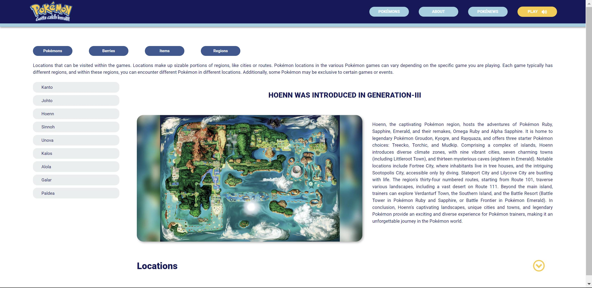
 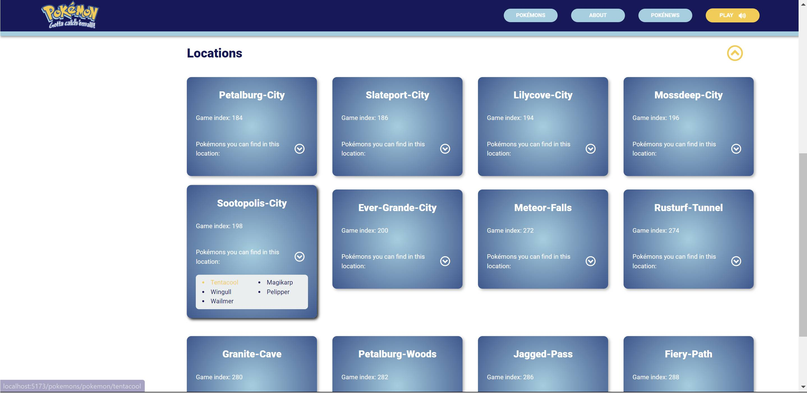


### About
This page provides general information about the Pokémon enthusiast community and its values. For the nostalgics, a section has been created that takes them through introductions of the 25 series seasons in a video that can be viewed in full screen, with playback control in the user's hands.

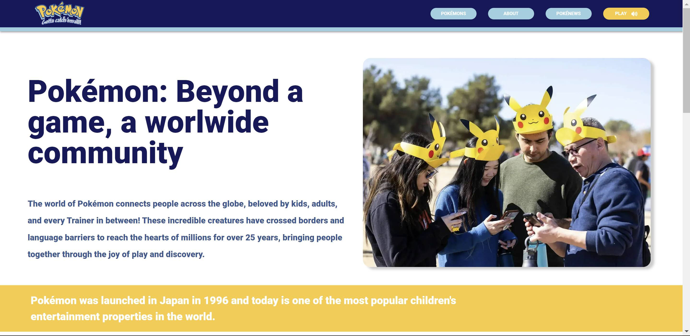
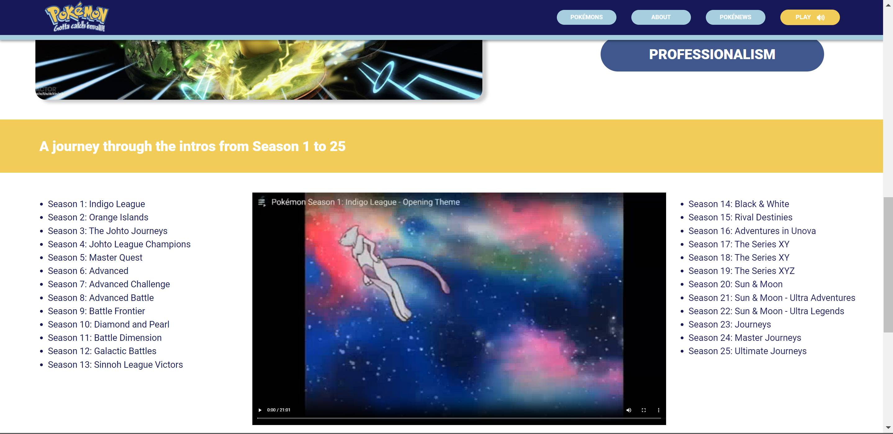


### PokéNews

This page showcases different blog post excerpts stored in the MongoDB database. Clicking on each post redirects users to the complete post, sourced from the official website https://www.pokemon.com/us.

At the bottom, a limited number of other articles are shown, allowing users to navigate until they find articles of interest.

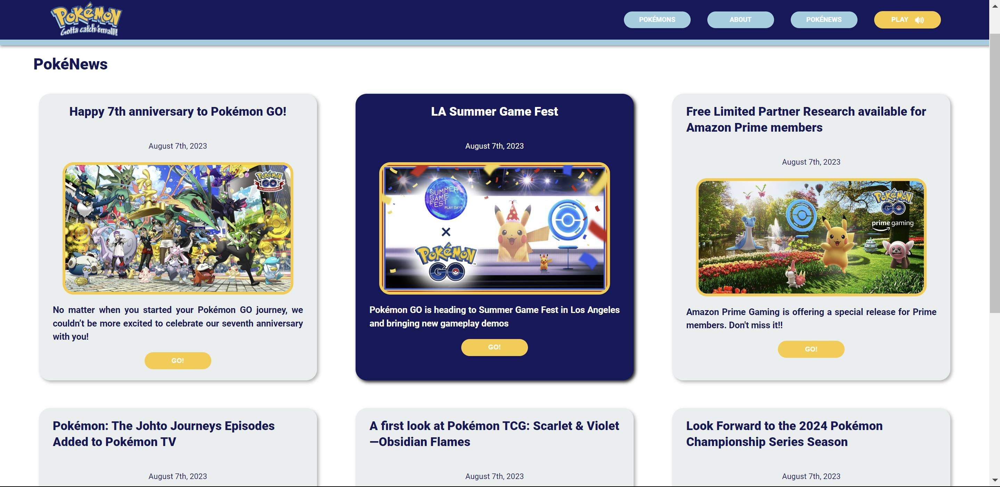
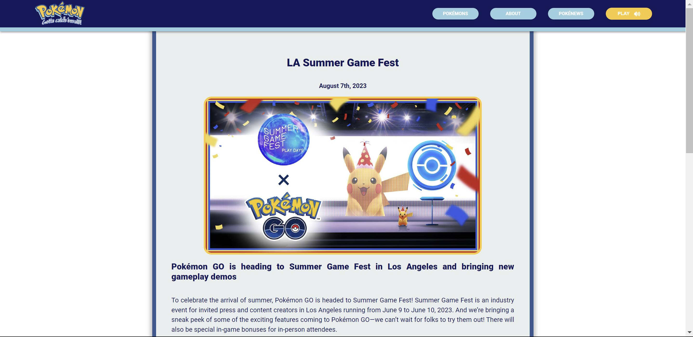
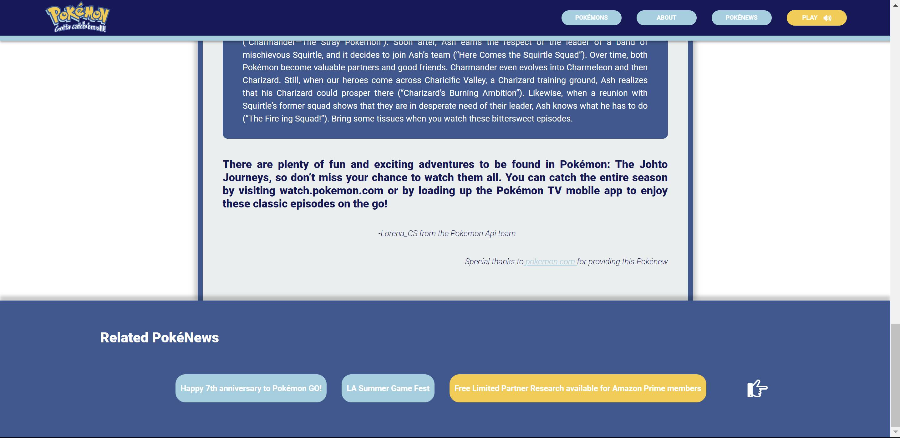


# Technologies Used
### Main Front-End Libraries:

* React
* React-Router-Dom
* React-Query
* Axios

### Main Back-End Libraries:

* Express
* Mongoose (Database)
* MongoDB (Database)

# Installation
## 1. Prerequisites

To run Pokémon API locally, you need to have installed:
* Node.js
* MongoDB

## 2. Configuration:

* Clone this repository to your local machine:
````
$ git clone https://github.com/Ananke85/Pokemon_api.git
````
* Install project dependencies:
```
$ npm install
````
* Create a .env file in the project root and add the following environment variables:
```
PORT: 3005
MONGO_URL: [ ]
````
* Open a terminal and start the server:
```
$ npm start
````
* Open a different terminal and start the client:
```
$ npm run dev
````
* Open a web browser and go to the following port to view the application:
```
http://localhost:5173/

# Project Lead
Lorena Carmona

